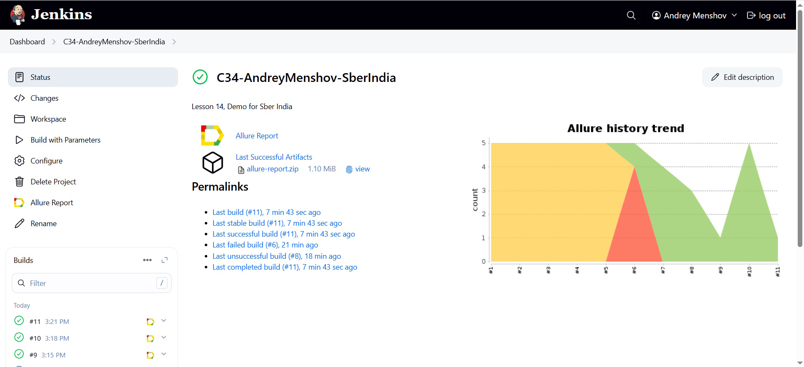
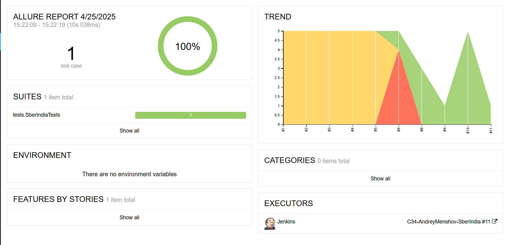
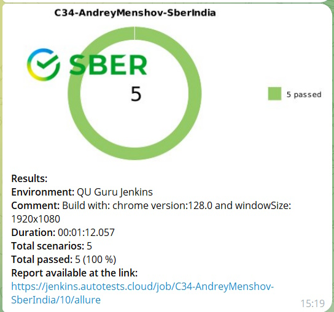

<a href="https://sberbank.co.in/ ">  
<h1 >Проект по автоматизации тестирования для компании <a href="https://sberbank.co.in/ "> Sber India</a></h1> 

## ☑️ Содержание:

- Технологии и инструменты
- Список проверок, реализованных в тестах
- Запуск тестов (сборка в Jenkins) и из терминала
- Allure-отчет
- Уведомление в Telegram о результатах прогона тестов
- Видео пример прохождения тестов

<a id="tools"></a>

## :ballot_box_with_check:Технологии и инструменты:

| Java                                                                                                           | IntelliJ  <br>  Idea                                                                                                              | GitHub                                                                                                                 | JUnit 5                                                                                                     | Gradle                                                                                                           | Selenide                                                                                                   | Selenoid                                                                                                            | Allure <br> Report                                                                                                   | Jenkins                                                                                                    | Telegram                                                                                                      
|:---------------------------------------------------------------------------------------------------------------|-----------------------------------------------------------------------------------------------------------------------------------|------------------------------------------------------------------------------------------------------------------------|-------------------------------------------------------------------------------------------------------------|------------------------------------------------------------------------------------------------------------------|------------------------------------------------------------------------------------------------------------|---------------------------------------------------------------------------------------------------------------------|----------------------------------------------------------------------------------------------------------------------|------------------------------------------------------------------------------------------------------------|---------------------------------------------------------------------------------------------------------------|
| <a href="https://www.java.com/"></a> | <a href="https://www.jetbrains.com/idea/"></a> | <a href="https://github.com/"></a> | <a href="https://junit.org/junit5/"></a> | <a href="https://gradle.org/"></a> | <a href="https://selenide.org/"></a> | <a href="https://aerokube.com/selenoid/"></a> | <a href="https://github.com/allure-framework"></a> | <a href="https://www.jenkins.io/"></a> | <a href="https://web.telegram.org/"></a> |<a href="https://qameta.io/"></a> |

<a id="cases"></a>

## :ballot_box_with_check: Реализованные проверки:

- Проверка footer у главной странице
- Переходим с главной страницы на страницу Exchange Rate и проверяем работу калькулятора
- Переходим с главной страницы на страницу Services и проверяем наличие кнопки Apply Now
- Переходим с главной страницы на страницу About Sber и проверяем заголовок страницы
- На главной странице наводим мышку на меню Trends и видим что события отображаются

##  Сборка в [Jenkins](https://jenkins.autotests.cloud/job/C34-AndreyMenshov-SberIndia/)

<p align="center">  
</a>  
</p>

## :ballot_box_with_check: Параметры сборки в Jenkins:

- browser (браузер, по умолчанию chrome)
- browserVersion (версия браузера, по умолчанию 127.0) (доступные версии браузера для Chrome и Firefox динамически меняются
- browserSize (размер окна браузера, по умолчанию 1280x720)
- testSet (набор тестов - полный регресс или smoke)

## Команда для запуска из терминала

Локальный запуск

```bash
gradle clean all_tests
```

Запуск с параметрами:

```bash  
-Dbrowser=chrome -DbrowserSize=1920x1080 -DbrowserVersion=128.0
```

Удаленный запуск через Jenkins:

```bash  
clean
${TEST_SET}
-Dbrowser=${BROWSER}
-DbrowserVersion=${BROWSER_VERSION}
-DwindowSize=${BROWSER_WINDOW_SIZE}
-DselenoidUrl=${SELENOID_URL}
```

## </a>  <a name="Allure"></a>Allure Report    </a>

## Основная страница отчёта

<p align="center">  
  
</p>  

____

## </a> Уведомление в Telegram при помощи бота

____
<p align="center">  
  
</p>

____

## </a> Примеры видео выполнения тестов на Selenoid

____
<p align="center">
   
</p>

<p align="center">
   
</p>
